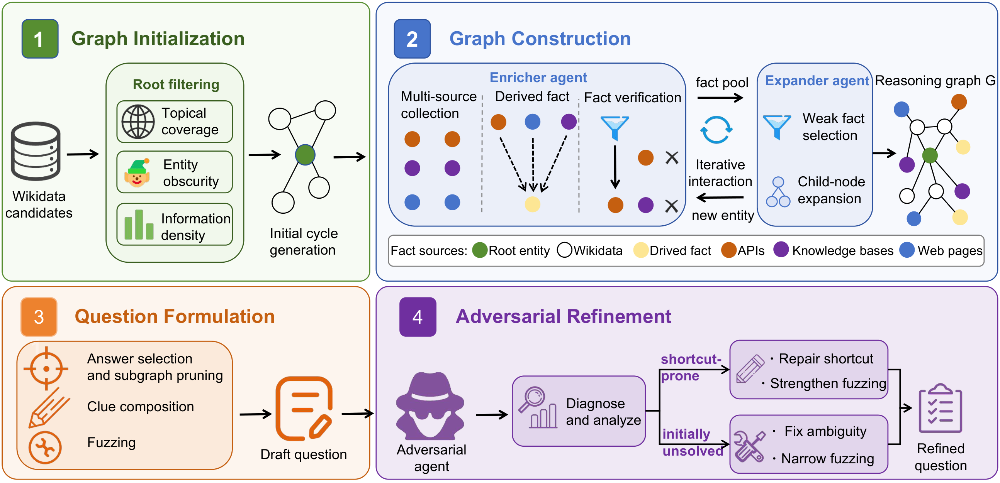
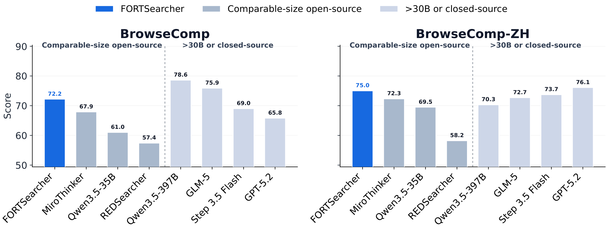
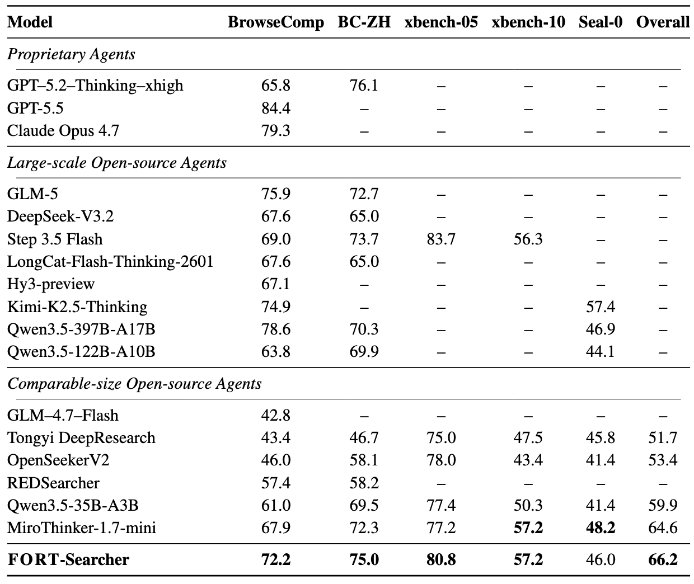

<h1 align="center">FORT-Searcher: Synthesizing Shortcut-Resistant Search Tasks<br>for Training Deep Search Agents</h1>

<div align="center">

The official repo for "FORT-Searcher: Synthesizing Shortcut-Resistant Search Tasks for Training Deep Search Agents".

📃 [Paper](https://arxiv.org/abs/2606.12087)&nbsp;&nbsp;|&nbsp;&nbsp;🤗 [SFT Dataset (coming soon)]()&nbsp;&nbsp;|&nbsp;&nbsp;🤗 [FORT-Searcher-30B-A3B (coming soon)]()

We will release the training data, evaluation code, and model weights. Stay tuned for updates!

</div>

## Overview

Training deep search agents requires verifiable questions whose answers remain unavailable until sufficient evidence has been acquired through search. Existing synthesis methods often increase apparent difficulty by enriching graph structures, but structural complexity alone does not guarantee realized search difficulty — the intended search process can collapse through a cheaper identifying route.

**FORT** (**F**ramework **o**f Shortcut-**R**esistant **T**raining-Data Synthesis) addresses this by formalizing four actionable shortcut risks and controlling them across the full data construction pipeline:

- **Evidence Co-coverage**: Multiple clues co-occur on a single page, allowing shortcuts
- **Single-clue Selectivity**: A single clue alone suffices to identify the answer
- **Exposed Constants**: Exact strings on the question surface make downstream queries directly executable
- **Prior-knowledge Binding**: The solver names the answer from parametric knowledge before retrieval

FORT controls these risks through entity selection, evidence graph construction, question formulation, and adversarial refinement, producing training data that induces genuinely long-horizon search behavior.

## Pipeline

<p align="center">
    
</p>

## Performance

<p align="center">
    
</p>

<p align="center">
    
</p>

## Release Plan

- [ ] Training Data (SFT Trajectories)
- [ ] Model Weights (FORT-Searcher-30B-A3B)
- [ ] Evaluation Code

## Citation

```bibtex
@misc{deng2026fortsearchersynthesizingshortcutresistantsearch,
      title={FORT-Searcher: Synthesizing Shortcut-Resistant Search Tasks for Training Deep Search Agents}, 
      author={Jia Deng and Yimeng Chen and Xiaoqing Xiang and Ziyang Zeng and Shuo Tang and Wayne Xin Zhao and Feng Chang and Chuan Hao and Yuan Wei and Ran Tao and Bryan Dai and Ji-Rong Wen},
      year={2026},
      eprint={2606.12087},
      archivePrefix={arXiv},
      primaryClass={cs.CL},
      url={https://arxiv.org/abs/2606.12087}, 
}
```

## Contact

- Jia Deng: dengjia0510@outlook.com
- Yimeng Chen: yimeng.chen@kaust.edu.sa
- Wayne Xin Zhao: batmanfly@gmail.com
- Feng Chang: fchang@iquestlab.com
